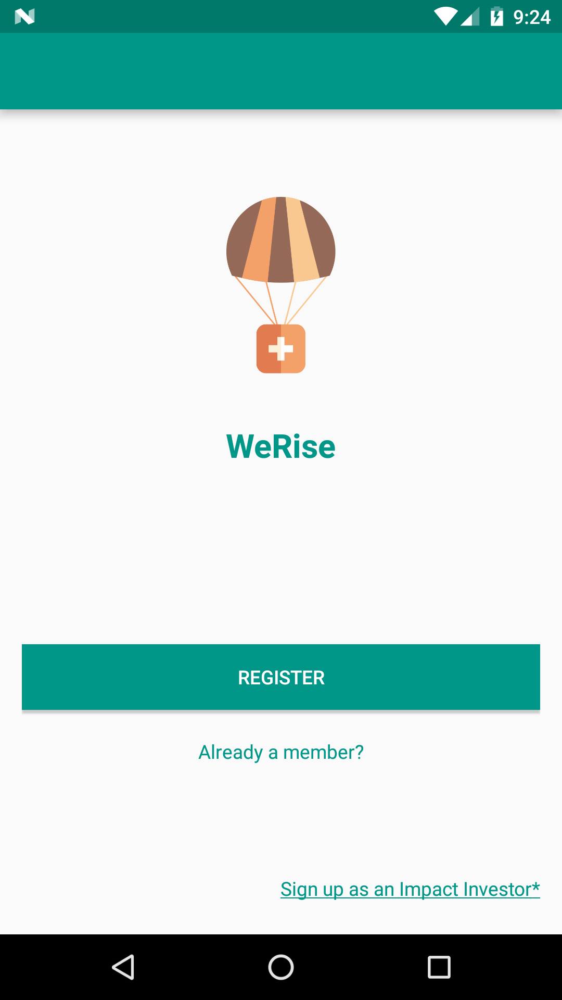
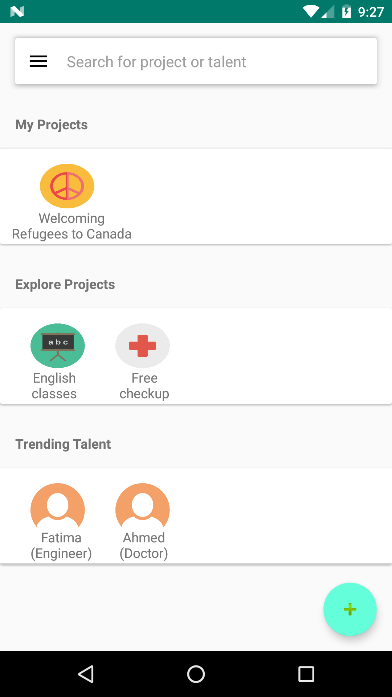

# WeRise Android Application

Developed at ILM Innovation Weekend 2017, WeRise connects you and other changemakers to create, collaborate and build social development projects within the community. Be the difference you wish to see in the world by starting a project, recruiting talent within your community and lead a project with possible milestones in fundraising, creating social awareness and establishing partnership with organizations. The Android application will serve as a tool to bring your ideas to life by discovering other social entrepreneurs around you and facilitating an in-app collaboration workspace all throughout the project’s timeline. The application was submitted to a panel of judges for review, where criteria such as business model, marketing strategy and product evaluation were taken into consideration.

## Screenshots

 

 

Additional screenshots available in the [Screenshots](Screenshots)

## Milestones

- **WeRise 1.0.0**:
	- Initial commit of the WeRise App developed at the ILM Innovation Weekend 2017. 
	- Commit id: 3c459e295eef7b62d1bc9fa87599e80317cfa5cc

## Credit

Logo created with: http://logomakr.com